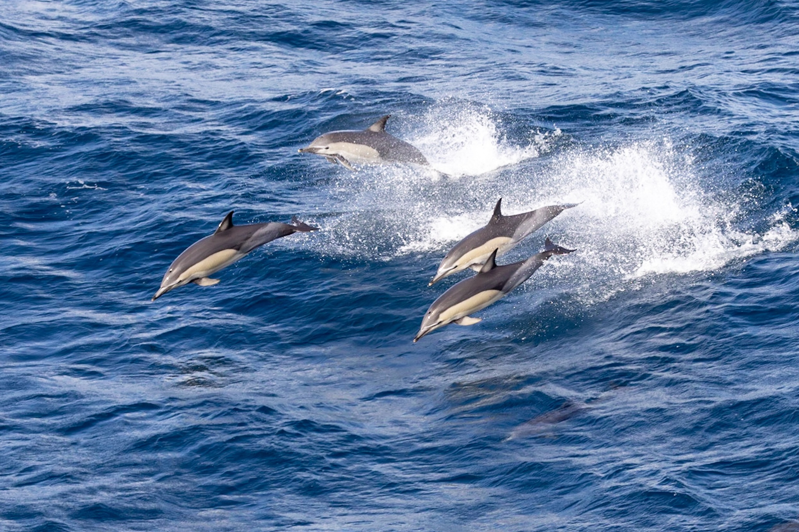

// add cover image to img directory and update filename below
ifdef::backend-html5[]

endif::backend-html5[]

== Colophon

=== Suggested citation

https://orcid.org/0000-0002-6590-599X[Kyle Copas] & https://orcid.org/0000-0002-5015-5807[Tim Hirsch] (2015) GBIF Communications Strategy. GBIF Secretariat: Copenhagen. https://doi.org/10.15468/doc-6yp9-9885.

=== Licence

The document _GBIF Communications Strategy_ is licensed under https://creativecommons.org/licenses/by-sa/4.0[Creative Commons Attribution-ShareAlike 4.0 Unported License].

=== URI persistente

https://doi.org/10.15468/doc-6yp9-9885

=== Document control

Published 2015

=== Cover image

// Caption. Credit, source, licence.
Long-beaked common dolphin (_Delphinus capensis_), South Atlantic Ocean. Photo 2019 Ken Chamberlain via https://www.gbif.org/occurrence/2235477584[iNaturalist research-grade observations], licensed under http://creativecommons.org/licenses/by-nc/4.0/[CC BY-NC 4.0].
